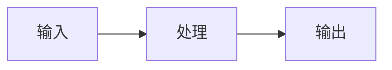

---
concept: <概念名>
english_alias: <英文/别名>
domain: <领域>
generated_by: concept-learner
date: <YYYY-MM-DD>
review_status: 待人工核查
---

# <概念名> 学习笔记

## 学习目标

学完这一篇，你应该能回答：
1. <问题一>
2. <问题二>
3. <问题三>

## 一句话理解

我的理解：<≤3 句话，自己的话，禁止整段照抄定义>
我自己的类比：<把概念比作生活中熟悉的东西>

## 核心机制 / 组成

<讲清内部怎么运作：组成部件 + 运行顺序，配 Mermaid 图或分步列表>

## 具体应用场景

**场景一：<场景名>**。<输入、输出、为什么用它>
（1-2 个真实具体场景）

## 容易混淆的概念辨析

| 概念 | 本质 | 区分口诀 |
|---|---|---|
| <易混概念A> | <本质> | <一句话区分> |
| <易混概念B> | <本质> | <一句话区分> |

## 使用边界 / 常见误区

- <何时不该用它>
- <容易犯的错误>
- 常见误区：<澄清一个大众误解>

## 自测问题

1. <判断题/简答题>

<答案要点>

2. <场景题>

<答案要点>

## 参考来源

1. **<机构> —《<标题>》（<年份>）**
   <URL>
   用途：<支撑文中哪个论断>
2. ...（≥3 个，全部真实访问并核实）

> 核查记录：<说明哪些链接何时核实；哪些类比为个人加工>
